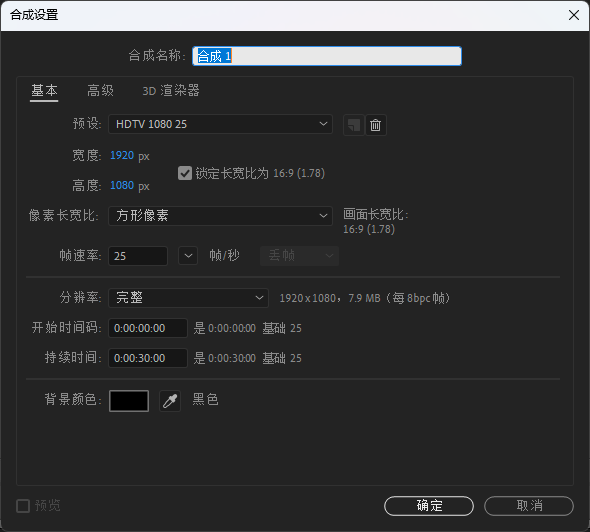
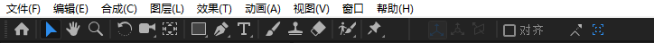
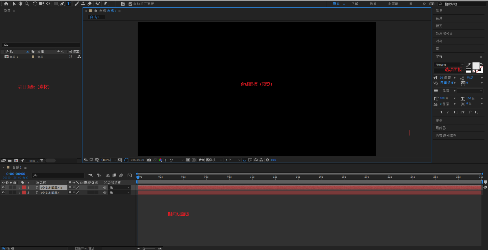
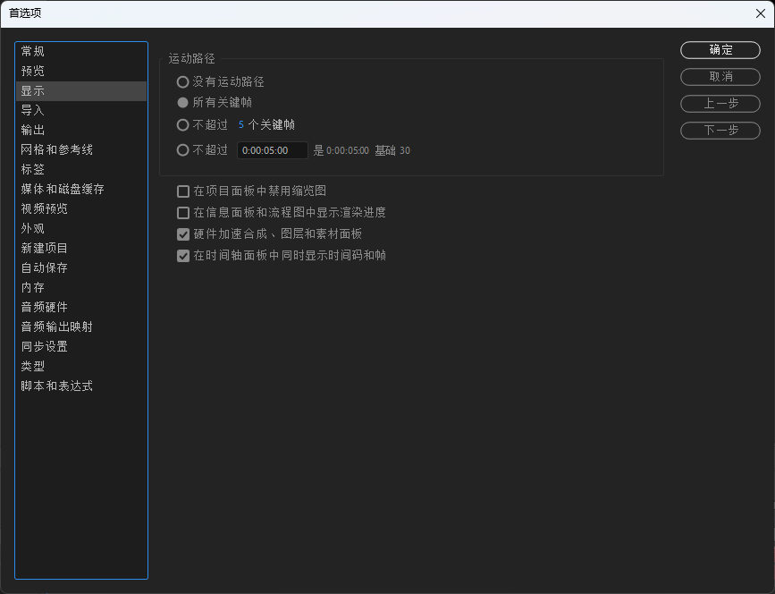
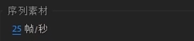
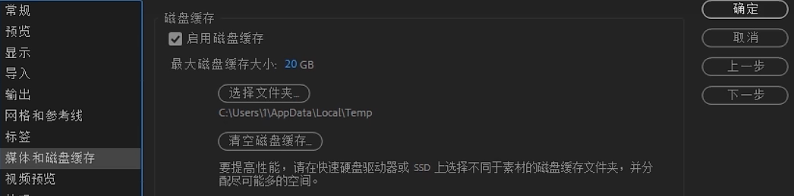
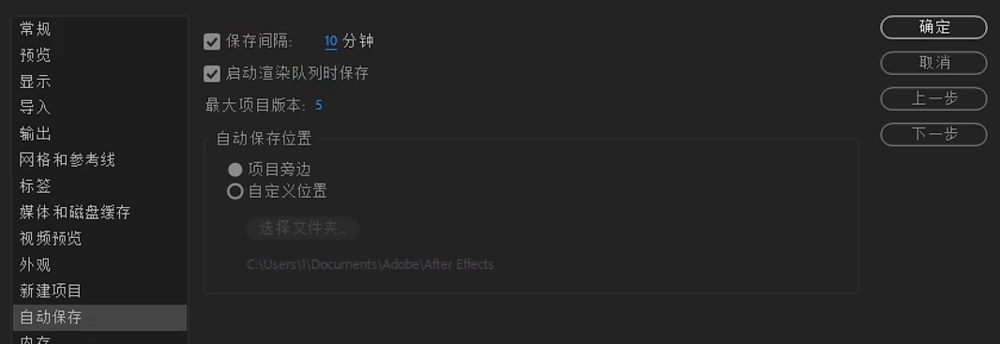

# AE入门

## 基础概念

AE是一款专业特效合成软件，通过对收集到的素材进行数字化的编辑组合到一起，进行艺术性的再加工后得到的最终作品。

### 预设

例如：HDTV 1080 25

1080就是指的1080p，清晰度

25指的是帧速率fps，一秒有多少帧

#### 帧

帧是影像动画中最小单位的单幅影像画面。时：分：秒：帧。

#### 帧速率

在1秒钟时间里传输图片的帧数，也可以理解为图形处理器每秒钟能够刷新几次，通常用fps（Frames Per Second）表示。

#### 电视制式

PAL制式：每秒25帧，隔行扫描。中国、德国、英国等国家采用这种制式。

NTSC制：每秒29.97帧，隔行扫描。美国、加拿大和日本等国家采用这种制式。

### 界面

#### 工具栏与快捷工具

alt键+鼠标坐标，快速切换相同工具的子工具。

选取工具：选取内容，移动当前内容

抓手工具：移动画布，快捷键，空格键长按+鼠标移动画布

放缩工具：默认放大，alt键+鼠标坐标改为缩小，滚动滑轮

### 首选项

显示菜单中，勾选所有关键帧

导入菜单中，序列素材25帧/秒

磁盘缓存按照实际情况设置

自动保存间隔

### 关键帧

关键帧就是指角色或者物体运动或变化中的关键动作所处的那一帧。是编辑动画和处理特效的核心技术。关键帧记录动画或特效的特征及参数，中间画面的参数侧有计算机自动运算并添加。

### 高清视频

物理分辨率达到720p以上统称为高清，简称HD（高分辨率）。国际上公认的有两条关于高清的标准：视频垂直分辨率超过720p或1080i；视频宽高比为16：9.

全高清是指物理分辨率高达1920x1080显示。

### 渲染导出

将当前合成，以特定编码的形式导出为视频。

常用视频格式：

- AVI格式
- MOV格式
- MPEG格式
- WMV格式
- MP4格式
- TGA序列文件

常用音频格式

- WAV格式
- MP3格式

## 图层

### 概念

- 层级关系
  - 项目》合成》图层
- 图层类型
  - 文本图层
  - 纯色图层
  - 灯光图层
  - 摄像机图层
  - 空对象图层
  - 形状图层
  - 调整图层

图层移动：

- `Ctrl+[,Ctrl+]`，控制图层上下移动
- `Ctrl+Shift+[`,`Ctrl+Shift+]`,移动图层到最上方，最下方

### 内容

图层中的各种形状等等

### 变换参数

- 锚点：类似与坐标原点，用来控制旋转与缩放的参考依据。
  - 快捷键：`A`
- 位置：在画布上的位置
  - 快捷键：`P`
- 缩放：
  - 快捷键：`S`
- 旋转：
  - 快捷键：`R`
- 不透明度：
  - 快捷键：`T`

## 关键帧与时间轴

### 基础快捷键

`CTRL+K`，调出合成设置

单击空格，预览视频

`Alt+鼠标滑轮`，调整时间线显示比例

`B、N`控制预览素材的长度

`CTRL+shift+D`，分割素材

`alt+[`，裁剪并删除左侧素材

`alt+]`，裁剪并删除右侧素材。

`PageUp/PageDown`，逐帧调节时间线

### 关键帧

秒表图形，点击打上初始关键帧，后续关键帧点击左边进行操作。

全选关键帧，Alt+鼠标左右滑动，等比例缩放，实现速率快慢控制。

时间反向关键帧：将选中的关键帧进行反向。

`U`，查看当前图层正在变化中的关键帧参数

`J，K`，向前/后移动一个关键帧

## 蒙版

F4打开图层面板里的更多工具，轨道遮罩

## 预合成

`CTRL+Shift+C`，将多个图层嵌套在一起（嵌套序列），构建预合成

## 线性与非线性动画

缓动动画：自然界中的物体从起点移动到终点时，速度从来不是一成不变的。汽车由快到慢，篮球来回反弹，都遵循一定的运动规律，变速运动。要制作出自然的动画，就需要使用到缓动函数。让观众得到更舒适的视觉体验。

### 缓动函数

用于控制动画从初始值运动到最终值的速率。

- 快捷键`F9`，将关键帧变为平滑帧，点击图标编辑器图标，在图标编辑器面板中单击右键选择编辑速度图标，即可调整运动快慢。

### 运动模糊

快速运动的物体会产生一定的模糊效果。

- 在图层开关栏中打开运动模糊开关，注意，时间线面板中运动模糊总开关也要打开。

## 表达式

快捷键：Alt+点击秒表
