# Stable Diffusion本地部署

## 视频教程

来源：**Nenly同学**([Mac系统有救了！入门AI绘画，Stable Diffusion详细本地部署教程！自主安装全解（附一键解压文件与前置安装包）| 解决各种安装报错卡进度问题_哔哩哔哩_bilibili](https://www.bilibili.com/video/BV1Us4y1X75d/?spm_id_from=333.788&vd_source=44dd29d35ca204257e05e0e3275e55fe))

本文档参考上述视频总结

## 前置安装

### python -v 3.10

[进入网址]([Python Releases for Windows | Python.org](https://www.python.org/downloads/windows/))

cmd验证当前python版本

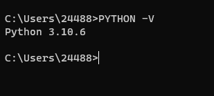

### git
[进入网址](https://git-scm.com/)

### 显卡驱动

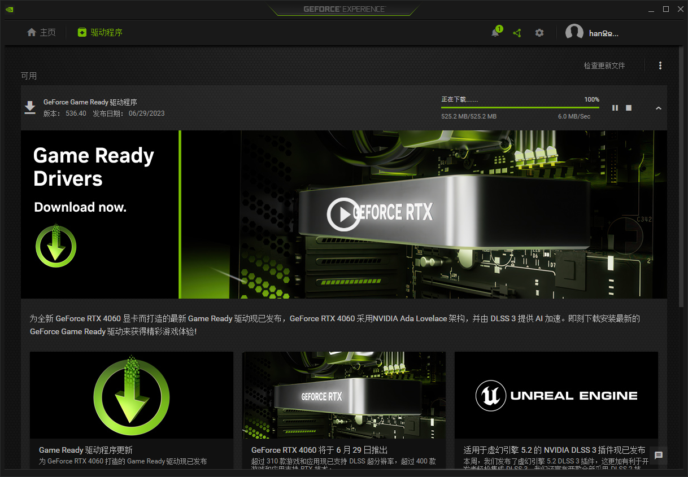

[显卡驱动程序网址](https://www.nvidia.cn/geforce/geforce-experience/)

点击检查更新文件更新驱动

### webui克隆

[stable-diffusion-webui]([AUTOMATIC1111/stable-diffusion-webui: Stable Diffusion web UI (github.com)](https://github.com/AUTOMATIC1111/stable-diffusion-webui))git仓库

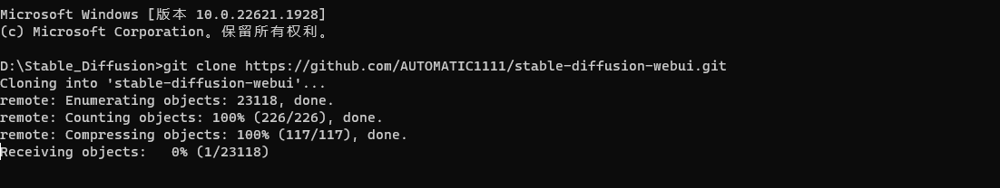

```git
git clone https://github.com/AUTOMATIC1111/stable-diffusion-webui.git
```

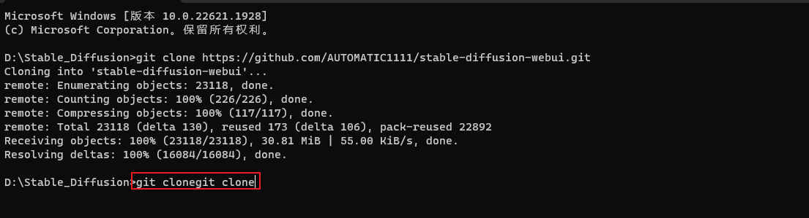

安装完毕.

## 安装依赖

### webui-user.bat运行

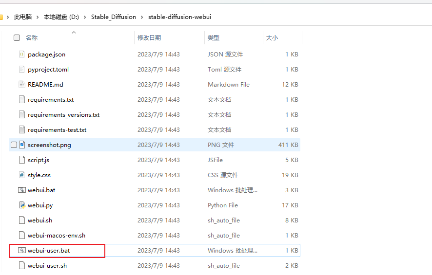

找到克隆后的文件夹下webui-user.bat，双击自动安装依赖

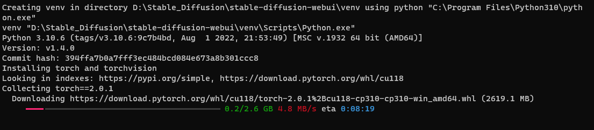

### 卡gfpgan依赖情况

如果遇到卡依赖的情况，如下列包，


复制``https://ghproxy.com/``添加到``launch_utils.py``中``https://github.com/``前面（共七个）。

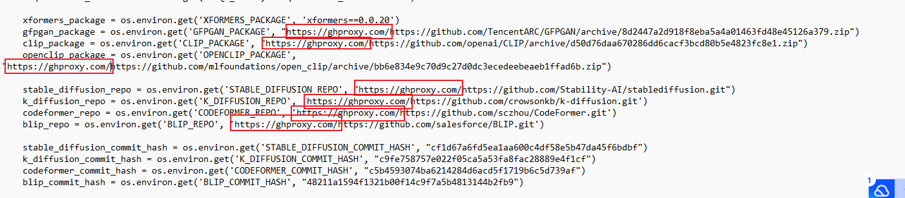

### No module ‘xformers‘. 

> No module 'xformers'. Proceeding without it.

参考该解决办法[(121条消息) No module ‘xformers‘. Proceeding without it._no module 'xformers_SYC_MORE的博客-CSDN博客](https://blog.csdn.net/qq_40902709/article/details/128152329)

### pip更新

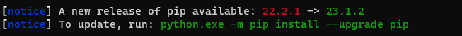

运行以下代码：

```
python.exe -m pip install --upgrade pip
```

### 安装成功

出现以下代码表示部署成功

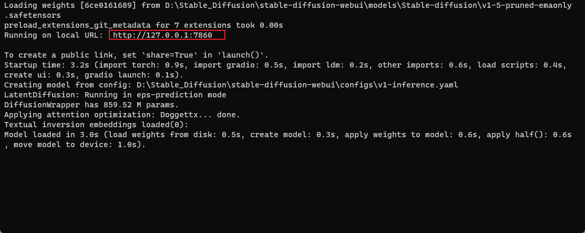

，打开[http://127.0.0.1:7860/](http://127.0.0.1:7860/)网址，出现以下页面表示成功

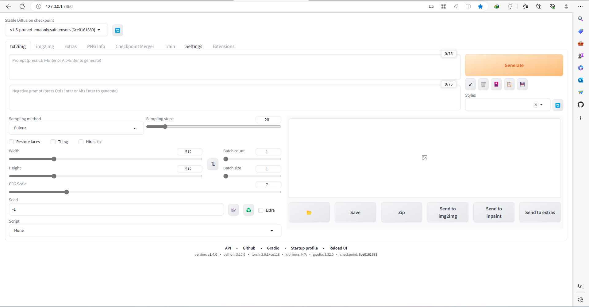


## 安装扩展

### 步骤

打开网页后，依次点击Extensions>Available，复制以下文件指向链接到Extension index URL，点击Load from.

https://gitee.com/akegarasu/sd-webui-extensions/raw/master/index.json

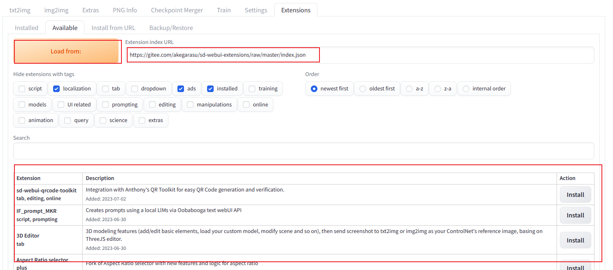
