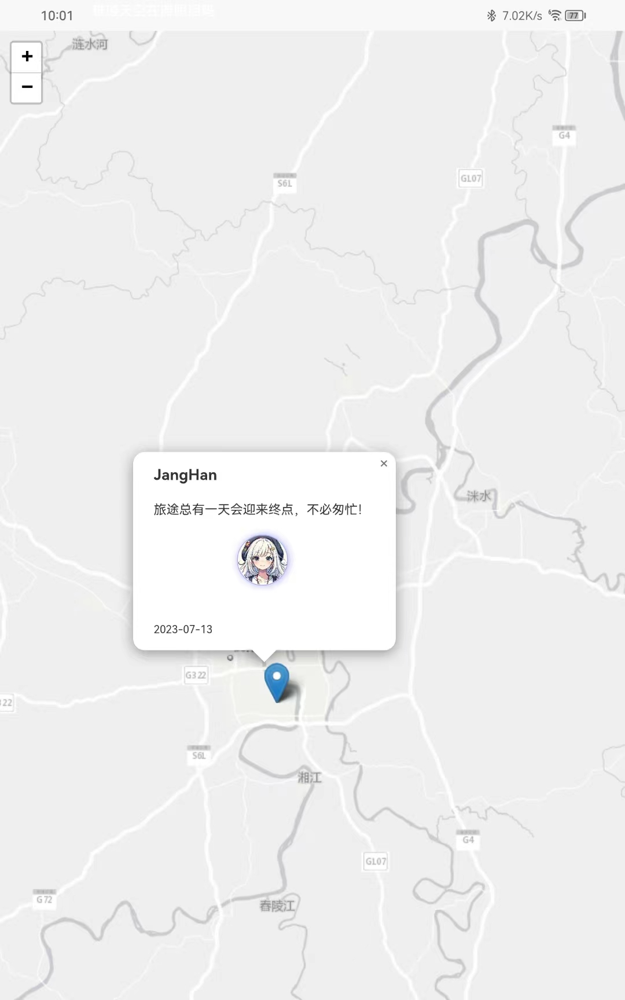
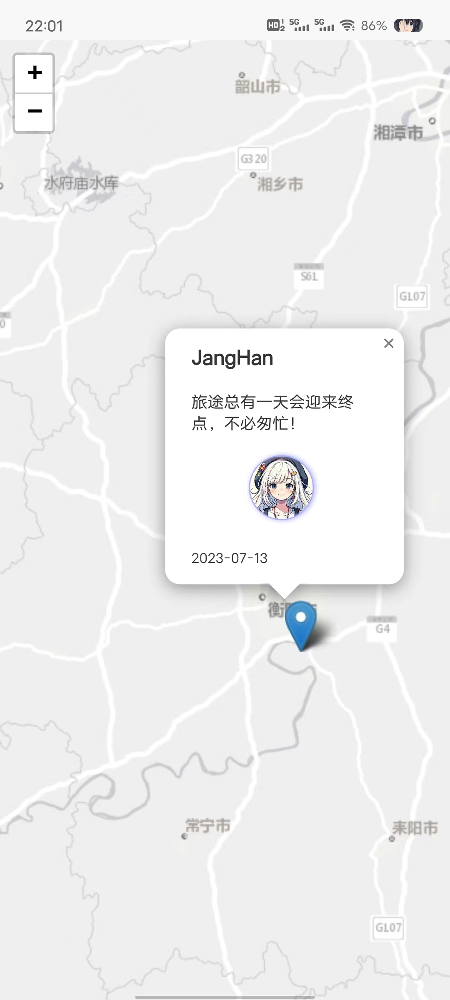

# UNI_APP运行三方包LeafletJS的Demo

> 初步尝试APP端，试错很久

## 平板演示效果



## 手机演示效果



## 代码

```vue
<template>
	<view class="content">
		<view id="map" class="map" :prop="points" :change:prop="leaflet.changePoints">

		</view>
		<view class="input_model" :class="{input_model_active:isModelActive}">
			<view class="close" @click="closeModelActive"></view>
			<view class="input_popup">
				<input type="text" placeholder="标题" v-model="title" :prop='title'
					:change:prop="leaflet.changeInputTitle">
				<input type="text" placeholder="请输入您的内容" v-model="text" :prop='text'
					:change:prop="leaflet.changeInputText">
				<span>字数不易过多</span>
				<button type="button" :prop="upload" @click="jiaoyan" :change:prop="leaflet.uploadPoint">上传</button>
			</view>

		</view>
	</view>
</template>

<script>
	export default {
		data() {
			return {
				points: [],
				isModelActive: false,
				title: null,
				text: null,
				upload: false
			}
		},
		onLoad() {},
		mounted() {
			this.initPont();
		},
		methods: {
			//初始化点集合
			initPont() {
				for (var i = 0; i < 3; i++) {
					var point = {
						"id": i,
						"title": "JangHan",
						"latlng": [26.89, 112.62],
						"imageurl": ["./static/images/1.jpg"],
						"text": ["旅途总有一天会迎来终点，不必匆忙！"],
						"date": "2023-07-13"
					}
					this.points.push(point);
				}
			},
			//弹出框状态
			closeModelActive() {
				this.isModelActive = !this.isModelActive;
				this.title = null;
				this.text = null;
			},
			//
			jiaoyan() {
				console.log('tttt',typeof(this.text));
				if (typeof(this.text) == 'object') {
					uni.showToast({
						title: '你忍心我空着吗',
						icon: 'error',
						image: '/static/images/MD_404.jpg'
					});
				} else {
					this.upload = !this.upload;
					this.closeModelActive();
				}

			}
			//

		}
	}
</script>

<script module="leaflet" lang="renderjs">
	import '@/libs/leaflet/leaflet.css'
	import L from '@/libs/leaflet/leaflet'

	export default {
		data() {
			return {
				map: null,
				icon: null,
				point: {
					"id": null,
					"title": "",
					"latlng": [],
					"imageurl": ["./static/images/2.png"],
					"text": [],
					"date": ""
				},
				//保存以往旧值实例化的id
				id: [],
				ownerInstance: null
			}
		},
		mounted() {
			this.initMap();
			this.initkMapEvent();
		},
		methods: {
			//初始化地图
			initMap() {
				//实例化灰度图
				const ChinaOnlineStreetGray = L.tileLayer(
					"https://map.geoq.cn/ArcGIS/rest/services/ChinaOnlineStreetGray/MapServer/tile/{z}/{y}/{x}", {
						layers: "ChinaOnlineStreetGray",
					}
				);
				this.icon = L.icon({
					iconUrl: './static/images/marker-icon.png',
					shadowUrl: './static/images/marker-shadow.png',
				});
				//实例化地图
				this.map = L.map('map', {
					center: [26.9, 112.60],
					zoom: 13,
					minZoom: 3,
					maxZoom: 16,
					layers: [
						ChinaOnlineStreetGray,
					],
					attributionControl: false
				});
			},
			//监测点集合变化
			changePoints(newValue, oldValue, ownerInstance, instance) {
				if (newValue != oldValue) {
					console.log('初始化点集合');
					this.ownerInstance = ownerInstance;
				}
				this.points.forEach((point) => {

					// 若实例化的id中没有当前point的值，则实例化点标记
					if (this.id.indexOf(point.id) == -1) {
						this.id.push(point.id);
						//实例化点信息
						this.createMarker(point);
					}
					// console.log(this.id);
				})
			},
			//
			//生成点标记
			createMarker(point) {
				// console.log('实例化了一个点', point.id);
				//实例化弹窗信息
				var popupcontent = this.createPopup(point);
				// console.log(popupcontent);
				L.marker(point.latlng, {
					icon: this.icon
				}).bindPopup(popupcontent).addTo(this.map);
			},
			//生成模板弹窗信息
			createPopup(point) {
				//标题
				var title = "<h3>{0}</h3>".replace('{0}', point.title.toString());
				//文本内容
				var text = '';
				//遍历文本内容
				point.text.forEach((txt) => {
					text = text + "<p>{0}</p>".replace('{0}', txt.toString());
				});
				var images = "<div class='parent' style ='display:flex;align-items: center;justify-content: center;'>";
				//遍历图片内容
				point.imageurl.forEach((img, index) => {
					images = images +
						"<div class='div{1}'></img></div>".replace(
							'{0}', img).replace('{1}', index + 1).toString();

				});
				images = images + "</div>"
				//日期
				var date = "<span>{0}</span>".replace('{0}', point.date);
				//组合弹窗信息
				var popupContent = "<div class='popup'>" + title.toString() + text.toString() + images.toString() + date
					.toString() + "</div>";
				// 返回弹窗信息
				return popupContent
			},
			//初始化地图事件
			initkMapEvent() {
				//转变指向
				const that = this;
				this.map.on('click', function(e) {
					that.point.latlng = [e.latlng.lat, e.latlng.lng];
					// that.isModelActive = true;
					// console.log(that.isModelActive);
					//调用方法
					that.ownerInstance.callMethod('closeModelActive');
				})
			},
			//监测文本框变化
			changeInputTitle(newValue, oldValue, ownerInstance, instance) {
				if (!newValue) {
					console.log('title null', newValue);
				} else {
					this.point.title = newValue;
				}
			},
			//
			changeInputText(newValue, oldValue, ownerInstance, instance) {
				if (!newValue) {
					console.log('text null', newValue);
				} else {
					this.point.text = [];
					this.point.text.push(newValue);
				}
				console.log('this');

			},
			//获取日期
			getNowDateText() {
				var year = new Date().getFullYear();
				var month = new Date().getMonth() + 1;
				// if(month<10){
				// 	month ='0' + month.toString()
				// }
				var day = new Date().getDate();
				var hours = new Date().getHours();
				var minutes = new Date().getMinutes();
				return year + '-' + month + '-' + day + ' ' + hours + ':' + minutes
			},
			//
			uploadPoint(data) {
				console.log("点击");
				this.point.date = this.getNowDateText();
				this.point.id = Date.now();
				if (this.point.latlng.length == 0) {
					console.log('latlng');
				} else {
					console.log(this.point);
					this.points.push(this.point);
				}
			}
		},
	}
</script>

<style lang="scss">
	.content {
		display: flex;
		flex-direction: column;
		align-items: center;
		justify-content: center;
		position: relative;
	}

	//地图属性
	#map {
		width: 750rpx;
		height: 100vh;
		z-index: 1;

		.popup {
			max-width: 300rpx;
			max-height: 400rpx;
			box-sizing: border-box;
			overflow: hidden;

			img {
				border-radius: 50%;
				border: 1rpx solid #aaaaff;
				box-shadow: #aaaaff 1rpx 0rpx 10rpx;
				object-fit: cover;

			}

			p {
				max-height: 110rpx;
				display: -webkit-box;
				-webkit-box-orient: vertical;
				-webkit-line-clamp: 3;
				overflow: hidden;
			}

			span {
				display: flex;
				right: 0;
				font-size: smaller;
				margin-top: 40rpx;
			}
		}
	}

	//输入弹出框
	.input_model {
		display: none;
		// background-color: #00000045;
		width: 750rpx;
		box-sizing: border-box;
		position: absolute;
		height: 100%;
		z-index: 2;
		pointer-events: stroke;
		color: black;
		transition: 1s all;

		.close {
			width: 750rpx;
			height: 100%;
			background-color: #00000010;
			position: absolute;
			z-index: 3;
			transition: 1s all;
		}

		.input_popup {
			width: 750rpx;
			height: 40%;
			box-sizing: border-box;
			position: absolute;
			background-color: white;
			bottom: 0;
			pointer-events: auto;
			padding: 100rpx 30rpx;
			z-index: 3;
			transition: 1s all;

			input {
				height: 70rpx;
				margin: 30rpx 10rpx;
				box-shadow: 2rpx 4rpx 10rpx #00000011;
				background-color: #ffffff45;
				padding: 3rpx;
				border: 1rpx dotted #00000010;
			}

			span {
				font-size: 6rpx;
				color: #00000050;
				padding-left: 20rpx;
			}

			button {
				width: 300rpx;
				bottom: 20rpx;
				margin-top: 50rpx;
			}

		}


	}

	//变动样式
	.input_model_active {
		display: block;
	}
</style>
```

## 安装包

点击下载<a href="../media/20230715LeafletDemo.apk" download='LeafletDemo.apk'>安装包</a>

