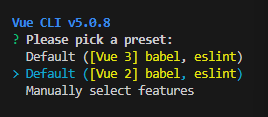
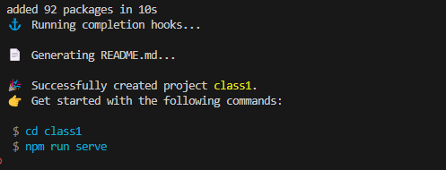
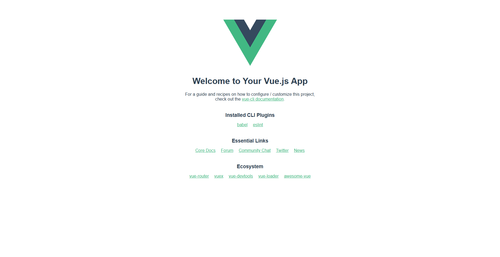

# Vue 入门

## 准备

[开发文档](https://v2.cn.vuejs.org/v2/guide/)

[1小时学会Vue之脚手架 哔哩哔哩_bilibili](https://www.bilibili.com/video/BV13m4y1Y7MD/?p=2&spm_id_from=pageDriver)

### 安装nodejs

[Node.js (nodejs.org)](https://nodejs.org/zh-cn)

选择版本v16.20.1

### npm指令

~~~
npm view 包名 version 	# 查看包的全部版本
npm install 包名@版本号 -g # g代表全局
npm ls 包名 -g 			# 查看本地安装包的版本号，g查看全局
~~~

### 设置淘宝镜像源

~~~cmd
npm config set registry https://registry.npm.taobao.org/
~~~


## 安装

官方文档中Vue2最新稳定版本为2.7.14


~~~
npm install vue@2.7.14 -g #安装vue
npm install -g @vue/cli # 安装vue-cli 
# vue-cli是vue.js的脚手架，用于自动生成vue.js+webpack的项目模板
~~~

## 创建项目

首先需要以管理员身份打开vscode

~~~
vue create 项目名称 #创建项目
~~~

选择vue版本，方向键选择，回车确定，这里选择vue2





```
vue ui #图形化界面创建项目
```


## 运行

优先cd到项目目录中

~~~
npm run serve  # 运行vue
CTRL + C # 停止运行
~~~



## 打包

```
npm run build # dist目录
```

我们需要安装serve进行运行指定目录

```
npm i serve -g # i install简写

#运行指定目录
serve dist

CTRL + C # 停止运行
```

## 目录结构

```

└─lesson01
    ├─dist					# 打包后的目录
    │  │  favicon.ico
    │  │  index.html 
    │  ├─css
    │  └─js
    │          
    ├─node_modules 			# npm加载项目的依赖模块
    │  
    ├─public				# 不参与编译的资源
    │      favicon.ico
    │      index.html
    │      
    └─src					# 保存需要参与编译的资源
    |   │  App.vue
    |   │  main.js
    |   │  
    |   ├─assets			# 静态资源，被编译为base64格式
    |   │      logo.png
    |   │      
    |   └─components		# 组件
    |           HelloWorld.vue
    └─main.js 				#vue应用的入口
```

