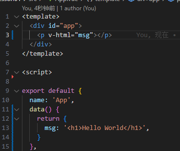

# Vue核心语法

## 响应式数据与插值表达式

​	在数据呈现时候，我们不仅要进行数据的逻辑处理，还要对数据进行呈现处理，频繁进行DOM操作

​	响应式数据，省去了我们对数据的DOM操作，让我们更关注数据的逻辑处理


​	在data 中申明一个变量`msg`，给它赋值，这个变量就是响应式数据

​	在页面中利用插值表达式插入`msg`变量，用`{{}}`来框住变量


我们写入一个方法，对值进行改变

## 属性

- methods：封装我们自定义的函数方法


- computed：计算属性
  - 具有缓存性：第一次计算后，将计算结果进行缓存，后续进行计算时，如果响应式数据不发生改变，则结果一定不会改变，后续不变的方法调用直接调用缓存数据
  - 其中函数方法调用时不能加括号


- watch：监听器
  - 监听值变化


## 指令

- `v-text`将数据输出到元素内部，如果输出的数据有HTML代码，会作为普通文本输出


- `v-html`将数据输出到元素内部，如果输出的数据有HTML代码，会被渲染




- `v-model`实现双向绑定，目前v-model的可使用元素有：
  - `nput`
  - `select`
  - `textarea`
  - `checkbox`
  - `radio`
  - `components`（Vue中的自定义组件）


- `v-on`用于给页面元素绑定事件，
  - ```v-on:事件名="js片段或函数名"```
  - 可以简写``@事件名="js片段或函数名"``
- `v-for`遍历数据

```html
<ul>
    <li v-for="(item,index) in items" :key=index></li>
</ul>
```

- `v-if`条件判断。当得到结果为true时，所在的元素才会被渲染。 语法：`v-if="布尔表达式"`
  `v-show` 也是用于根据条件展示元素的选项指令，用法大致一样。
- `v-bind`参数。语法：`v-bind:[attributeName]`

```html
// 参数
<a v-bind:href="url">...</a>
// 动态参数
<a v-bind:[attributeName]="url"> ... </a>
这里的 attributeName 会被作为一个 JavaScript 表达式进行动态求值，求得的值将会作为最终的参数来使用。例如，如果你的 Vue 实例有一个 data property attributeName，其值为 "href"，那么这个绑定将等价于 v-bind:href。

同样地，你可以使用动态参数为一个动态的事件名绑定处理函数：
<a v-on:[eventName]="doSomething"> ... </a>
在这个示例中，当 eventName 的值为 "focus" 时，v-on:[eventName] 将等价于 v-on:focus。
对动态参数的值的约束
动态参数预期会求出一个字符串，异常情况下值为 null。这个特殊的 null 值可以被显性地用于移除绑定。任何其它非字符串类型的值都将会触发一个警告。
```

- 事件修饰符
  - `.stop` ：阻止事件冒泡到父元素
  - `.prevent`：阻止默认事件发生
  - `.capture`：使用事件捕获模式
  - `.self`：只有元素自身触发事件才执行。（冒泡或捕获的都不执行）
  - `.once`：只执行一次

- 按键修饰符

  - `.enter` (13)
  - `.tab`
  - `.delete` (捕获“删除”和“退格”键)
  - `.esc`
  - `.space`
  - `.up`
  - `.down`
  - `.left`
  - `.right`

- 组合按钮

  可以用如下修饰符来实现仅在按下相应按键时才触发鼠标或键盘事件的监听器。

  - `.ctrl`
  - `.alt`
  - `.shift`

```html
<!-- 只有在 `keyCode` 是 13 时调用 `vm.submit()` -->
<input v-on:keyup.13="submit">
<!-- 缩写语法 -->
<input @keyup.enter="submit">

<!-- Alt + C -->
<input @keyup.alt.67="submit()">
<!-- Ctrl + Click -->
<button @click.ctrl="clear">Clear</button>

```