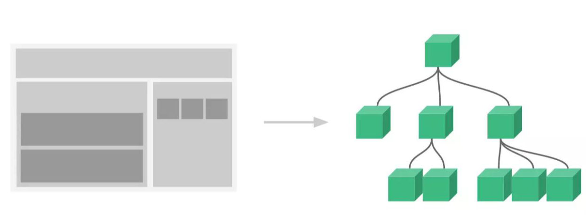

# 组件化开发

[Vue组件化开发_LIL_TOM的博客-CSDN博客](https://blog.csdn.net/m0_61924520/article/details/126723259)

## 组件介绍

组件：是一个独立显示的视图单元，在构建大型应用时，我们通常会把可复用性强的部分。
. （例如：头部导航、侧边栏等需要在多个页面展示的部分）提取出来，最终组合成一个完整的页面。
. 在vue中，组件是可复用的vue实例。

## 组件的定义

### 组件的注册

全局组件：注册之后可以用在任何新创建的 Vue 根实例 (new Vue) 的模板中，全局组件必须写在Vue实例创建之前。

全局组件缺点：组件注册之后无法被回收，一直保存在内存中。

局部组件：使用对象定义组件，在vue实例对象上使用components属性声明本模块的局部组件，在components对象中，属性名就是自定义组件名，属性值就是该组件的选项对象。

### 组件的引用

- 引用方式类似于标签，用尖括号包裹组件名

### 组件的复用

- 每个组件都可以任意次数的复用
- 每个组件都是独立的，它们都有自己的实例，每个组件只能有一个根元素

### 组件引用规则

- 由于HTML对于大小写是不敏感的，我们在DOM模板中需要使用kebab-case写法
- 在单文件组件、字符串模板和 JSX 中，组件引用时需要使用PascalCase写法

### 组件的闭合

- 在 DOM 模板中，建议使用标签闭合组件
- 在单文件组件、字符串模板和 JSX 中，建议使用自闭和组件

